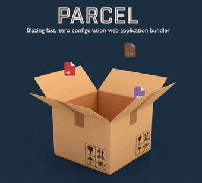

# A parcel bundler template, inegrated with "Sass" and Babel polyfill plugin



### based and inspired by [Brad Traversy Video](https://www.youtube.com/watch?v=8rD9amRSOQY&list=PLLDPbs5wkrIJ-L4VXSwKjd19Zq0ZoT53u&index=31) and CSS files structure by [Elad Shechter](https://www.youtube.com/watch?v=HjJEcZDmHM4)

<br>

--

## instructions:

- download the zip or clone the repo
- install the node modules by running `npm install` or `npm i ` from your terminal

<br>

## scripts

### Dev script:

- Will ensure the deletion of the dev & cache folders and will start your project in a default port 3000.
- You can change the deault port by setting different port number instead of 3000 just change the `-p 3000` to your desire port.

```json

 "dev": "rm -rf ./development && rm -rf ./.cache && parcel public/index.html --out-dir development -p 3000"

```

### Build script:

- Will build your project files & assets into one bundle, again by removing cache folders and the previous build version.

- You can customized the output directory by chaing the `--out-dir` command

- The `--public-url` is crucial for making sure that in the build command we get a relative path to our assets.

```json
"build": "rm -rf ./dist && rm -rf ./.cache && parcel build public/index.html --out-dir dist --public-url ./"
```
